<div align="center">

<picture>
  <source media="(prefers-color-scheme: dark)" srcset="Assets/logo/light/vertex-stacked-light.png">
  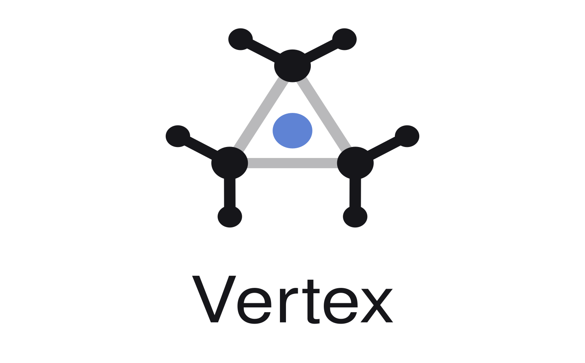
</picture>

# **BIG DISCLAIMER AND SOME PERSONAL WORDS**
This entire project is vibe coded. I used Claude Pro to make this entire thing.

I know AI is arse.

I fully acknowledge the ethical, ecological and moral implications that using LLMs bring along with them. Let alone the copyright side of things. 

I know I was using the hard work and the combined 10s of thousands of hours of learning of every **real** and **skilled** developer that is out there. But I was in need of a solution to the only "gripe" I have using Linux. 

I did my switch from Windows to Linux. Getting everything working was pretty easy. Even multi-audio track clip recording was super easy due to GPU Screenrecorder's existence. 

On Windows, I used SteelSeries Moments to capture my gaming clips. Showing them to my friends is super easy. You can adjust the volume or mute audio tracks entirely. I really loved that. You can trim them, and easily export them to discord. Convenient.

But for some reason, no video player supports multi-audio-track playback out of the box. I did some "hacky" things to force my video player to play all audiotracks at once. It worked well.... But I couldnt easily turn down my microphone volume on one audio track, while leaving chat and game sounds at the same volume. So I tried using open source video editors, but I just couldnt get a solid workflow going. It all felt like so much effort to *quickly* edit (trim and adjust volumes per audio track) and share clips to my friends. 

With ongoing microphone issues, I have many clips where my microphone is way too loud. I did eventually fix it, but my historical clips are barely usable due to that fact. 

I use this project for myself. I have about 600 clips that I successfully imported into it. The performance is good. Editing, trimming and sharing works just like it does on the Windows counterpart. 


Talking to one of my friends who is a software developer. He told me the codebase is complete trash. But I should still put it on a Github repo under the MIT license. 

This will most likely be the only code, I will ever publicly share. 

If people are seeing the niche that it tries to cover, take this "project", re-write it, improve it. 

This intro section is written by me, the human behind it. The following showcase of this "project" was also written by AI. I did edit some parts to be more readable. 

**One final note:**

 If you have a gripe with people like me, who vibe code such a thing, thats completely okay. Just dont seek me out and harrass me.

---

**A clip manager for Linux like Steelseries Moments**

Vertex aims to make your gaming clips searchable, editable and easily shareable with your friends.

</div>

<p align="center">
  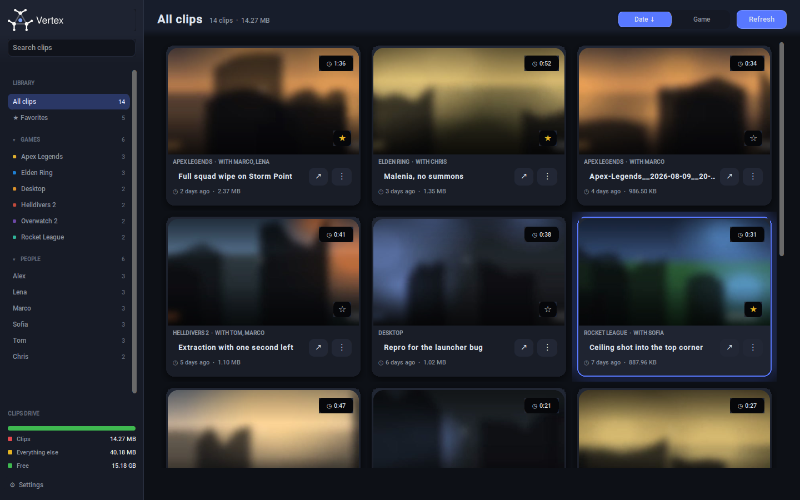
</p>

> **About the screenshots:** 
>
> Every screenshot on this page comes from a fake library —
> fake clip titles, fake names, and generated footage that is blurred
> at the source.

---

## Contents

- [Why it exists](#why-it-exists)
- [The library](#the-library)
- [Finding a clip](#finding-a-clip)
- [Tagging](#tagging)
- [The clip editor](#the-clip-editor)
- [Trimming](#trimming)
- [Exporting](#exporting)
- [Settings](#settings)
- [First run](#first-run)
- [Bringing an existing library in](#bringing-an-existing-library-in)
- [Install](#install)
- [How it is put together](#how-it-is-put-together)
- [Thanks](#thanks)
- [License](#license)

---

## Why it exists

**There is no quick way to edit a multi-track clip on Linux.**

Recording each source to its own audio track is the right thing to do, and GPU
Screen Recorder does it well — game, voice chat and microphone all land in the
same `.mp4` as separate streams. Everything downstream is where it falls apart.
Most players pick one track and ignore the rest. Force one to play them all at
once and they arrive welded together: you cannot pull your microphone down while
leaving game and chat where they are, which is the one adjustment nearly every
clip needs before anybody else should have to hear it.

Video editors can obviously do it. They also want a project, an import, a
timeline and an export dialog — minutes of setup for a thirty-second clip you
wanted to send to a friend now.

So Vertex is built around exactly that gap:

> **Open a clip, see every audio track as its own labelled lane with a live
> volume slider, trim it, send it.**

The sliders apply as you drag them, at the frame you are already on — no
re-render, no preview pass.

One rule holds throughout: **your recordings are never modified.** Every edit —
title, tags, favourites, trim points, per-track volumes — lives in a SQLite file
beside them, not in the files themselves.

- Scanning is read-only. Exports are written to a separate folder you choose.
- A trim either writes a new file, or moves the original to your desktop Trash
  and puts the trimmed one in its place — your choice, asked every time.
- Every path is yours to set at first run, XDG-aligned by default.
- No network, no telemetry, no account. It reads your disk and talks to ffmpeg
  and mpv. That is the whole surface.

---

## The library

<p align="center">
  
</p>

**Each card shows:**

| | |
|---|---|
| **Thumbnail** | A frame pulled with ffmpeg one second in, so you don't get a black intro frame. Cached as a JPEG, keyed on the file's size and mtime — re-record over a name and the thumbnail regenerates by itself. |
| **Hover preview** | Rest on a card for a moment and it plays back twenty frames spanning the whole clip, at about 3 fps. Enough to recognise the moment without opening it. |
| **Duration badge** | Probed in the background and remembered in the library, so it is there instantly the next time. |
| **Favourite star** | One click, top of the star list in the rail. |
| **Game and people** | The tag line, click to edit. |
| **Title** | Click to rename. The name is library metadata; the file on disk keeps its recorder-given name. |
| **Age and size** | "2 days ago" while a clip is recent, a real date once it is older than a month — because "412 days ago" is a number to decode, not a date. |

The grid only builds the cards that are actually on screen and recycles them as
you scroll, so a library of hundreds of clips opens as fast as one of ten.

**Per-clip actions**

<p align="center">
  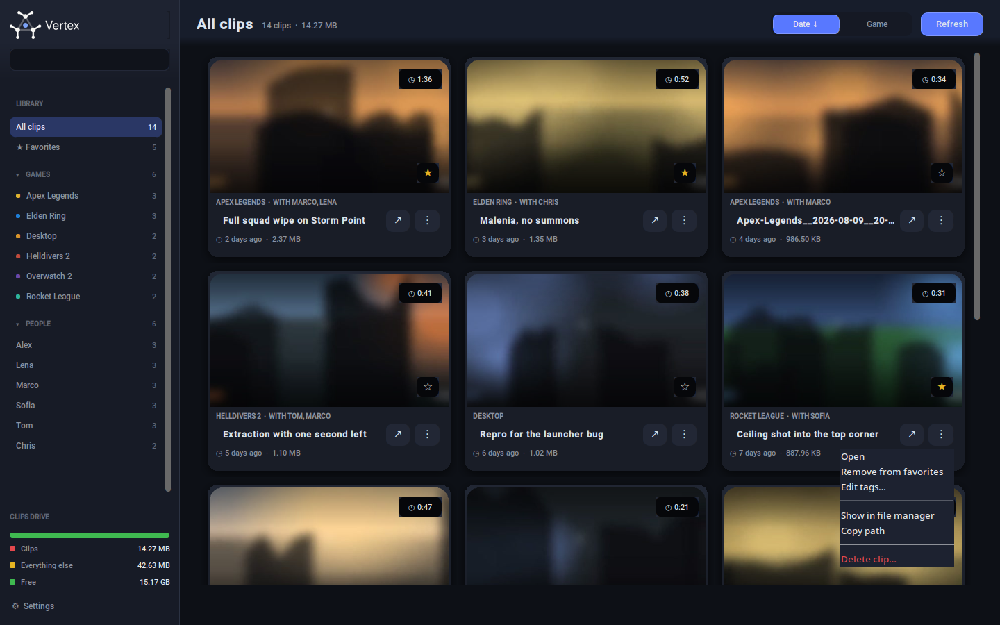
</p>

At the foot of the rail, the **disk gauge** splits the drive your clips are on
into what the clips take, what everything else takes, and what's free — and it
updates after a delete or a trim without a full rescan.

---

## Finding a clip

<table>
<tr>
<td width="50%">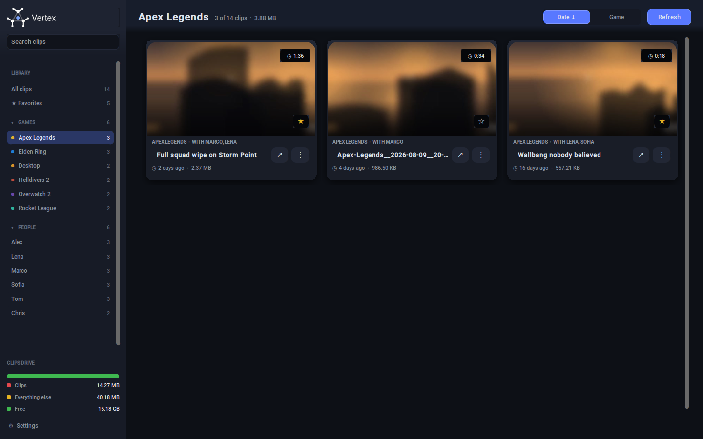</td>
<td width="50%">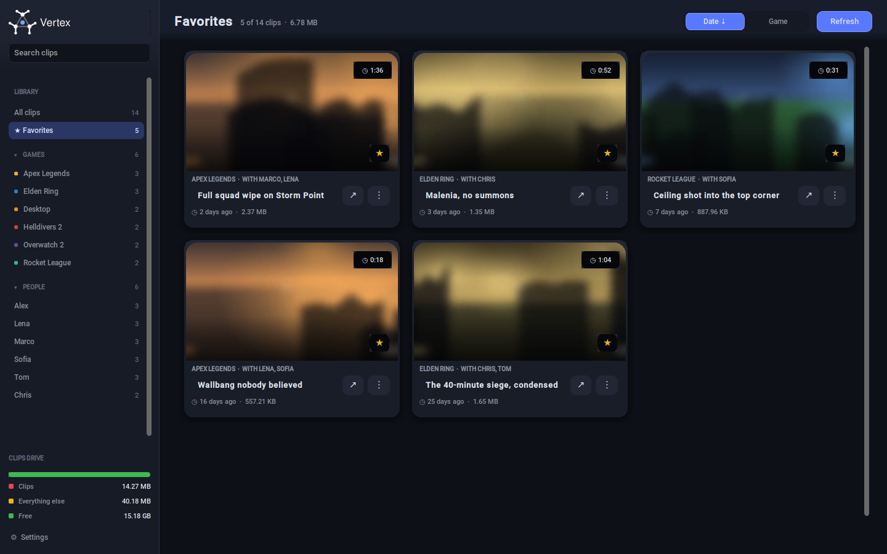</td>
</tr>
<tr>
<td align="center"><b>By game.</b> Every game in the library, each with its own colour and its clip count.</td>
<td align="center"><b>Favourites.</b> Everything you starred, in one row of the rail.</td>
</tr>
</table>

<p align="center">
  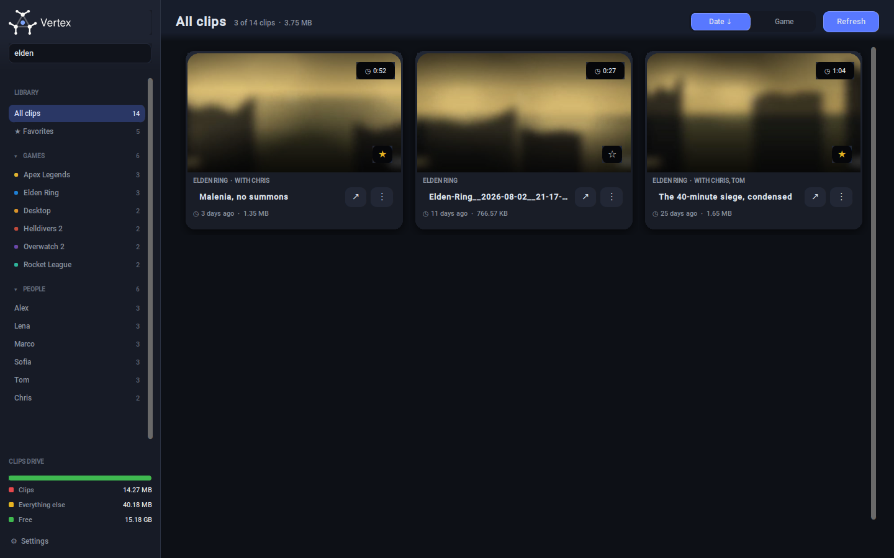
</p>

**Search** covers the game, the people, the title and the file name at once, and
filters the clips already scanned — it never goes back to disk, so it keeps up
with typing. **People** get their own list in the rail, so "every clip Marco is
in" is one click.

**Sort** is one control with a direction: pick Date or Game, click again to flip
it. Only the active button carries an arrow, so the one arrow on screen always
describes the order the grid is really in. Untagged clips stay at the end either
way.

---

## Tagging

<p align="center">
  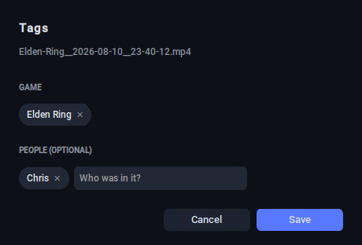
</p>

A clip has one **game** and any number of **people**. Both fields suggest tags
you have already used, so you don't end up with `Elden Ring` and `elden ring` as
two separate entries — matching ignores case and punctuation, but still requires
the words to match, so `Overwatch 2` stays distinct from `Overwatch`.

Most clips never need this. Vertex reads the game straight out of the file name
for recorders that put it there (`Apex-Legends__2026-08-11__22-14-07.mp4` →
*Apex Legends*), strips the ® and ™ that recorders keep, and tags GPU Screen
Recorder's fixed `Replay_…` naming as **Desktop**. A name that matches neither
convention is left untagged rather than guessed at — a wrong tag is worse than
no tag.

---

## The clip editor

<p align="center">
  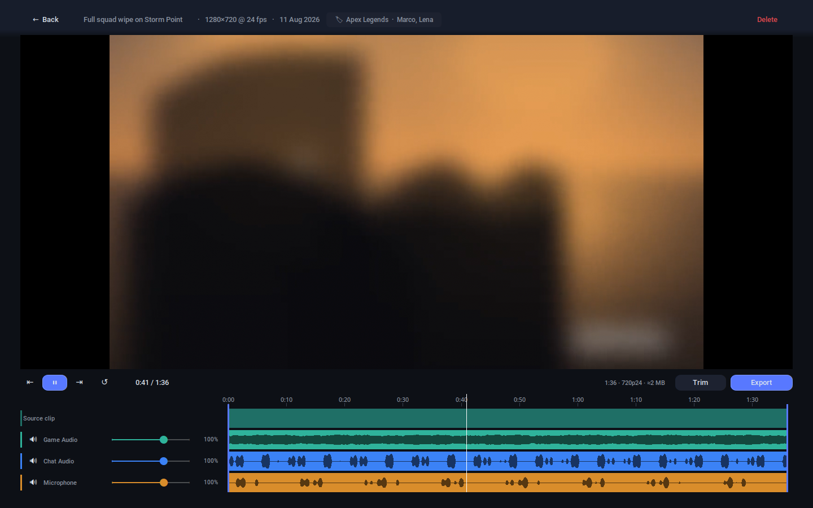
</p>

Click a thumbnail and the editor takes over the window. The rail steps aside and
the video gets the space.

### Playback

Proper playback, not a slideshow of decoded frames. Space or clicking the video plays and pauses, ← and
→ seek five seconds, Escape goes back to the grid. 

### The mixer

**The sliders are live.** Pull your microphone down and you hear it straight
away, at the frame you are already on — no re-render, no waiting for a preview.
You set the mix by ear, while the clip plays.

**Tracks are named, not numbered.** Tell Vertex once in Settings which devices
record your game, your chat and your mic, and from then on every clip labels its
lanes properly.

Clips recorded before you set that up are matched on the device name instead. If
the tracks genuinely can't be told apart they all fall back to numbers.

Each lane draws its own waveform, so you can see where somebody was actually
talking and scrub straight to it.

Volumes and mutes are remembered per clip and saved to a database. Files will remain untouched.

---

## Trimming

<p align="center">
  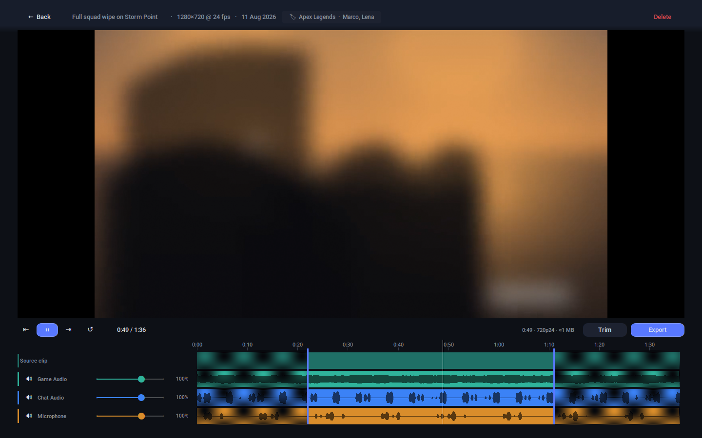
</p>

Drag the handles, or set In and Out at the playhead. Everything outside the
selection greys out across all lanes at once, and the estimate on the transport
bar follows the selection as you move it.

**Trim writes without re-encoding.** The cut starts at the nearest keyframe
before your In marker, and every audio track survives, so a trimmed clip can be
opened and edited again exactly like the original. You are asked what to do with
the result:

- **Save Trim as Copy** — writes `<name> (trimmed).mp4` beside the original and
  leaves the original alone.
- **Save Trim and Delete Clip** — keeps the original's name and sends the
  original to your desktop Trash (via `Send2Trash`; without it installed, that
  option deletes permanently and says so).

Either way the work is staged next to its destination under a hidden name and
only moved into place once it finishes — a cancelled trim leaves nothing behind.

---

## Exporting

<p align="center">
  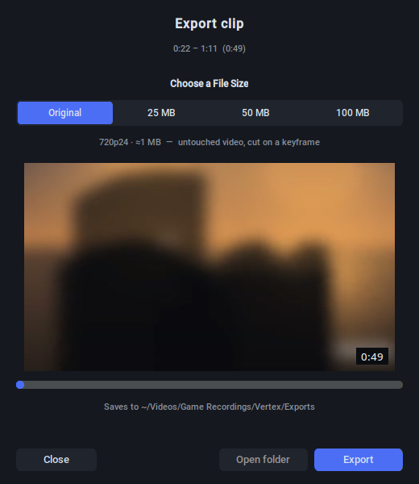
</p>

Pick how big the file is allowed to be. **Original** leaves the picture untouched
and only re-encodes the audio mix. The capped tiers re-encode to fit whatever
limit you are up against.

A size cap is hit rather than aimed at: the budget sets the bitrate, the
resolution steps down a ladder (1440 → 1080 → … → 360) until that bitrate is
enough to still look decent, and the encode is two-pass — single-pass overshoots
badly on high-motion gameplay. Progress is live and the export can be cancelled;
nothing appears in your Exports folder until it finishes.

---

## Settings


<table>
<tr>
<td width="50%">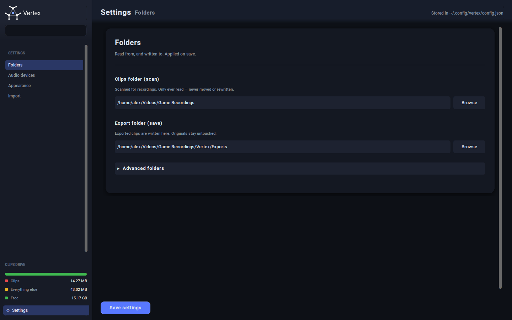</td>
<td width="50%">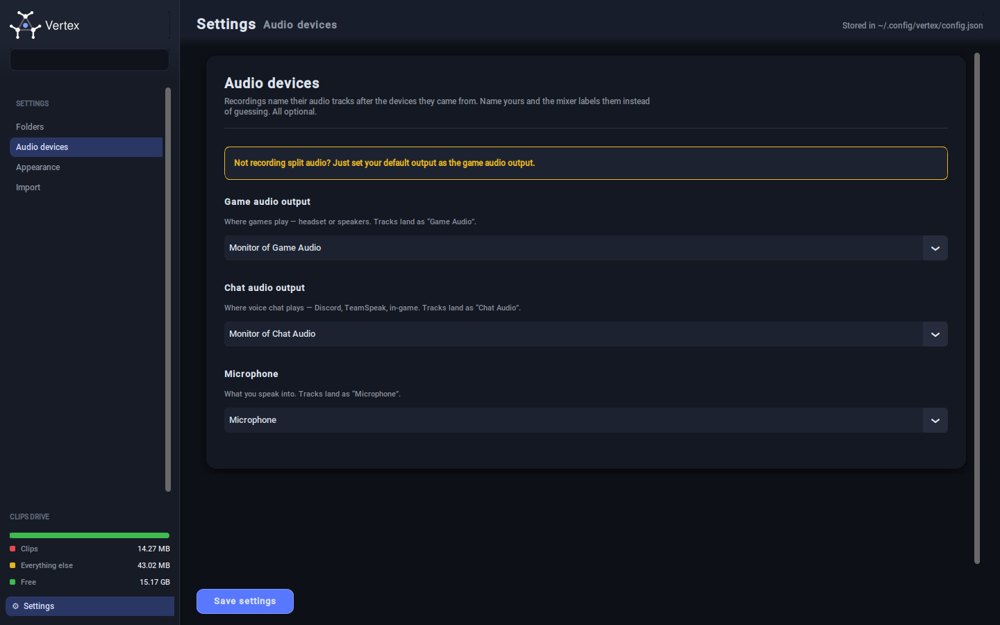</td>
</tr>
<tr>
<td align="center"><b>Folders.</b> Where clips are scanned from and exports are written to, plus the XDG data/state/cache dirs behind a disclosure.</td>
<td align="center"><b>Audio devices.</b> Name your game, chat and mic capture devices once, and every clip's mixer labels itself correctly. Read live from PipeWire/PulseAudio, typed by hand if neither answers.</td>
</tr>
<tr>
<td width="50%">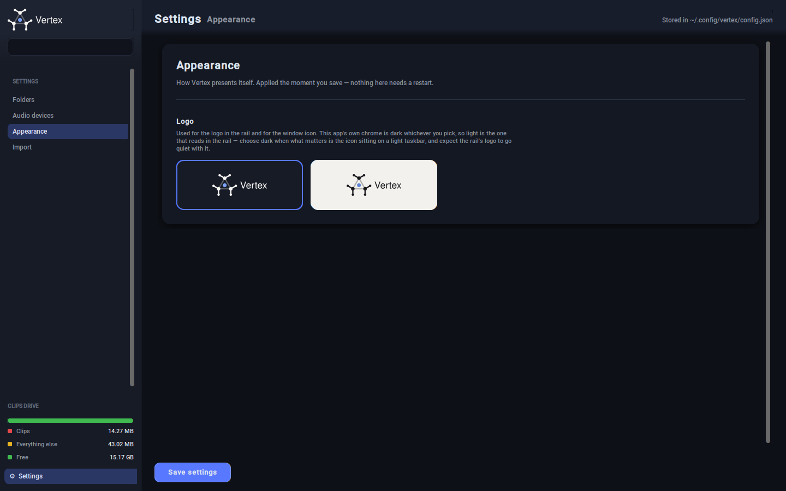</td>
<td width="50%">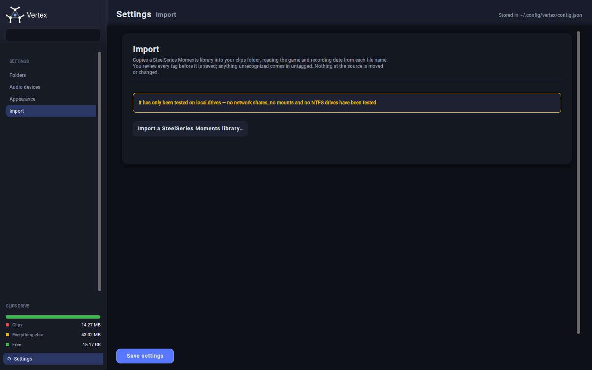</td>
</tr>
<tr>
<td align="center"><b>Appearance.</b> The logo ships in two inks — light artwork for dark desktops, dark for light ones — and you pick, because the app can't see the desktop it's sitting on.</td>
<td align="center"><b>Import.</b> Pull an existing recording library in, and tag what's already there.</td>
</tr>
</table>

If a folder a saved config names has since been renamed or unplugged, Vertex
catches it **before** it opens the library.

Instead you get a dialog and a setup wizard pre-seeded with your existing settings.

---

## First run

<p align="center">
  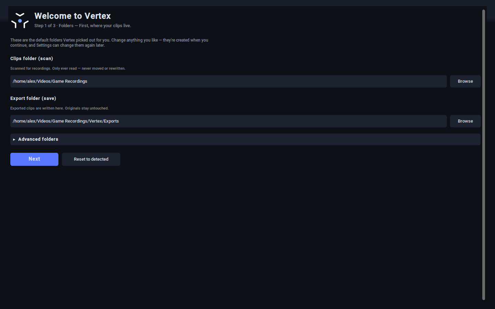
</p>

Pick the folder where your game recordings are located.
Non-English desktops (`Vidéos`, `Видео`) should resolve correctly. 

The export folder is created upon finishing the first run experience.

---

## Bringing an existing library in

<table>
<tr>
<td width="50%">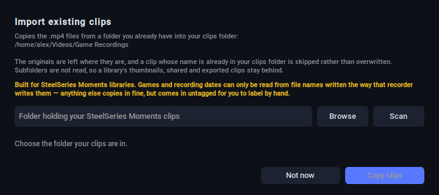</td>
<td width="50%">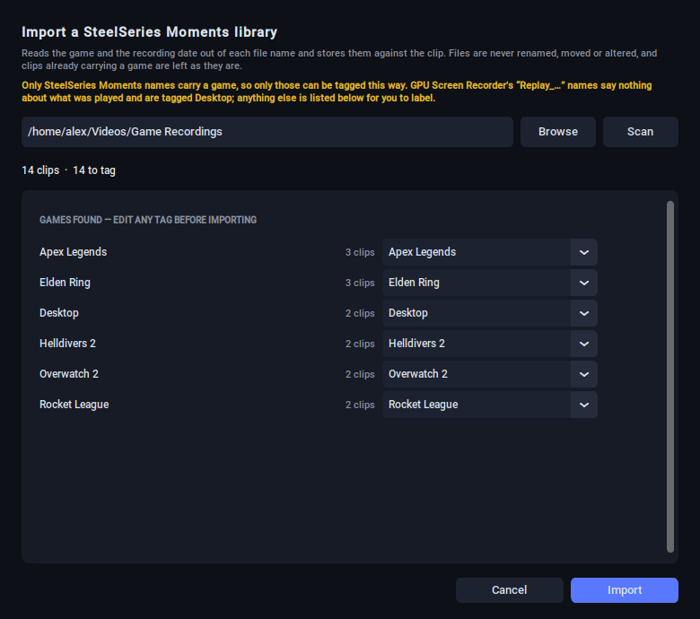</td>
</tr>
<tr>
<td align="center"><b>Copy clips in.</b> Points at a folder you already have and copies the <code>.mp4</code>s into your clips folder on a worker thread, with progress. Originals are only read; a name that already exists is skipped rather than overwritten.</td>
<td align="center"><b>Review the tags.</b> Every game derived from the file names is shown as an editable field before anything is written, so a recorder's <code>THE FINALS</code> can be pointed at the <code>The Finals</code> you already use.</td>
</tr>
</table>

Nothing is written from the review dialog until you confirm — cancelling really
does leave no trace.

---

## Install


> ## ⚠️ These instructions are AI-generated and unverified
>
> **Read every command before you run it. Do not paste them in blindly.**
>
> **IF YOU DO NOT KNOW OR DO NOT UNDERSTAND WHAT DOES COMMANDS DO, DO NOT RUN THEM BLINDLY**
>
> This project was ENTIRELY built with an AI assistant, and this section is no exception.
> The commands below were written from the model's own recollection of how these
> distros package things — **they have not been tested on Debian, Ubuntu or
> Fedora.** Package names drift between releases, `libmpv1` and `libmpv2` split
> depending on how old your distro is, and Tkinter is bundled with Python on some
> distros and a separate package on others.
>
> Every one of these lines is a `sudo` command touching your system packages.
> Check them against your own distro's package repository first. If something
> here is wrong, please open an issue or a PR with the correct line for your
> distro — that is genuinely the fastest way for this to get fixed.
>
> The same caution applies to the rest of this README: it describes the code as
> the assistant read it, not as anyone has independently audited it.

**System packages** (not pip — install these with your distro's package manager):

| Package | Why |
|---|---|
| `tk` | Tkinter, the toolkit the UI is built on |
| `ffmpeg` | thumbnails, waveforms, trimming, exporting (needs `ffmpeg` **and** `ffprobe`) |
| `mpv` / `libmpv` | video playback and the live audio mixing |

<details>
<summary>Distro one-liners</summary>

```bash
# Arch
sudo pacman -S tk ffmpeg mpv

# Debian / Ubuntu  (older releases ship libmpv1 instead of libmpv2)
sudo apt install python3-tk ffmpeg libmpv2

# Fedora
sudo dnf install python3-tkinter ffmpeg mpv-libs
```
</details>

**Then:**

```bash
git clone https://github.com/StellarGalaxyAtlas/vertex.git
cd vertex
python install.py
```

Python 3.10 or newer. No `pip install` step and no virtualenv to activate — the
installer builds the app one of its own.

**The clone is only the source.** `install.py` copies the app to a permanent
home, so once it has run the checkout can be moved, updated or deleted without
breaking anything:

```
~/.local/lib/vertex/app/     the program — main.py, src/, Assets/
~/.local/lib/vertex/venv/    its dependencies, kept across upgrades
~/.local/bin/vertex          the launcher, so `vertex` also works in a terminal
```

The start-menu entry points at that copy, not at your clone. To upgrade, pull
and run `python install.py` again: only `app/` is replaced, and it is swapped in
whole, so an interrupted upgrade leaves the version you had running.

### Nothing of yours is written to

The installer touches the program and the desktop entry. **Your config,
library, thumbnail cache, clips and exports are read to report on them and
otherwise left exactly where they are** — including a library still sitting
under one of the app's older directory names, which is found, reported, and not
migrated. Before it copies anything it prints what it found:

```
Your data
  read to report on it here; never written, moved or overwritten
  ✓ config   ~/.config/vertex/config.json
  ✓ library  ~/.local/share/vertex/library.db · 136.0 KB
  ✓ clip     ~/Videos/Game Recordings
```

It refuses outright to install into a folder that holds your files, and
`--uninstall` removes only the program, printing the `rm` lines for the rest
rather than running them.

### What else it checks

Requirements are verified against **the interpreter that will actually run the
app**, so a missing `libmpv` is reported before the first launch rather than as
a traceback during it. The distro packages are checked first, before anything is
copied, since no amount of installing will conjure those up.

```
python install.py --check           only report on the requirements
python install.py --prefix DIR      install somewhere other than ~/.local/lib
python install.py --icon light|dark which logo ink the desktop icon uses
python install.py --recreate-venv   rebuild the app's virtualenv from scratch
python install.py --no-venv         use the python running the installer instead
python install.py --reset-config    re-run first-run setup on next launch
python install.py --uninstall       remove the program, keeping all your data
```

`Send2Trash` is optional. With it, deleting a clip sends it to your desktop
Trash; without it, deletes are permanent and the UI tells you so.

<details>
<summary>Running from the checkout instead, for development</summary>

Nothing stops you running the source directly — the installed copy is a copy,
not a lock:

```bash
python -m venv .venv && source .venv/bin/activate
pip install -r requirements.txt
python main.py
```

Note that the start-menu entry still launches the *installed* copy, so run
`python install.py` when you want your edits to land there too.
</details>

---

## How it is put together

Short explanation of each file 

| File | What's in it |
|---|---|
| `core.py` | Config, path derivation, clip scanning, file-name parsing, storage stats. **No GUI imports** — runnable and testable on its own. |
| `database.py` | The SQLite library: titles, tags, favourites, trim points, per-track volumes. Clips are keyed by file name. |
| `export.py` | ffprobe/ffmpeg: probing, waveform peaks, the size→bitrate→resolution maths, two-pass command construction. Also GUI-free. |
| `gui.py` | The rail, the clip grid, cards, settings, first-run setup, the app shell. |
| `player.py` | The editor view: embedded mpv, the mixer, waveform lanes, the timeline, trimming. |
| `export_window.py` | The export sheet around `export.py`. |
| `widgets.py` | Shared widgets — modals, tag fields with suggestions, tooltips, editable labels. |
| `theme.py` | Every colour and radius in the app, in one place. |
| `paint.py` | Pillow-rendered gradients, drop shadows and card surfaces — the three things Tk cannot draw. |
| `thumbnails.py` | Thumbnail, preview and duration generation on a background pool, cached on disk. |
| `xguard.py` | Keeps libmpv's X error-handler reset from taking the whole process down when a video output is torn down. |
| `install.py` | Requirement checks, the copy into `~/.local/lib/vertex` and its virtualenv, XDG directories, desktop entry and icons. Never writes to anything the user made. |

---

## Thanks

Some more personal words from the human behind the scene. This "project" would have never come alive without projects like the following. I am grateful that there are passionate people out there that create and maintain libraries like this. I am so unbelievably thankful for the open source community. 

### Runtime

- **[mpv](https://mpv.io/)** — [github.com/mpv-player/mpv](https://github.com/mpv-player/mpv) ·
  *GPLv2+ / LGPLv2.1+*
  The video playback, and the reason the multi-track mixer is possible at all:
  very few players will mix several audio streams live through a filter graph
  you can swap out mid-playback.
- **[FFmpeg](https://ffmpeg.org/)** — [git.ffmpeg.org](https://git.ffmpeg.org/ffmpeg.git) ·
  *LGPLv2.1+ / GPLv2+*
  Thumbnails, hover previews, waveform peaks, keyframe-accurate trims and every
  export. `ffprobe` is what tells the app what is inside a clip in the first place.
- **[x264](https://www.videolan.org/developers/x264.html)** — *GPLv2+*
  The two-pass encoder behind every size-capped export.
- **[SQLite](https://sqlite.org/)** — *public domain*
  The whole library. Every edit you make is a row in one file you can copy,
  back up, or open with any tool you like.
- **[Tcl/Tk](https://www.tcl-lang.org/)** — *BSD-style*
  The toolkit underneath everything on screen.
- **[Python](https://www.python.org/)** — *PSF License*

### Python packages

- **[CustomTkinter](https://customtkinter.tomschimansky.com/)** by Tom Schimansky —
  [github.com/TomSchimansky/CustomTkinter](https://github.com/TomSchimansky/CustomTkinter) ·
  *MIT*
  Every widget in this app is one of these. It is the reason a Tkinter program
  can look like the screenshots above.
- **[python-mpv](https://github.com/jaseg/python-mpv)** by jaseg · *GPLv2+ / LGPLv2.1+*
  The ctypes binding that puts libmpv inside a Tk window and exposes its
  property API. `xguard.py` exists because of a sharp edge in that integration,
  not because of anything wrong with the binding.
- **[Pillow](https://python-pillow.github.io/)** —
  [github.com/python-pillow/Pillow](https://github.com/python-pillow/Pillow) ·
  *MIT-CMU*
  Thumbnail scaling, and all of `paint.py`: the gradients, drop shadows and
  composited card surfaces that Tk has no way to draw itself.
- **[Send2Trash](https://github.com/arsenetar/send2trash)** by Virgil Dupras and
  Andrew Senetar · *BSD-3-Clause*
  Deletes that go to the desktop Trash instead of into the void.
- **[darkdetect](https://github.com/albertosottile/darkdetect)** by Alberto Sottile ·
  *BSD-3-Clause* — pulled in by CustomTkinter.

### Prior art

- **SteelSeries Moments** and **[GPU Screen Recorder](https://git.dec05eba.com/gpu-screen-recorder/about/)**
  by dec05eba — the recorders whose output this reads. The file-naming
  conventions Vertex parses are theirs, and the export sheet's shape is
  modelled on Moments' share sheet.
- **[freedesktop.org](https://www.freedesktop.org/)** — the XDG Base Directory
  and Desktop Entry specifications, which are why the app knows where to put its
  files and how to land in your start menu.
- **[PipeWire](https://pipewire.org/)** and **[PulseAudio](https://www.freedesktop.org/wiki/Software/PulseAudio/)** —
  where the list of capture devices in Settings comes from.

Game titles shown in the screenshots are trademarks of their respective owners
and appear only as example data in a synthetic demo library.

---

## License

[MIT](LICENSE).
